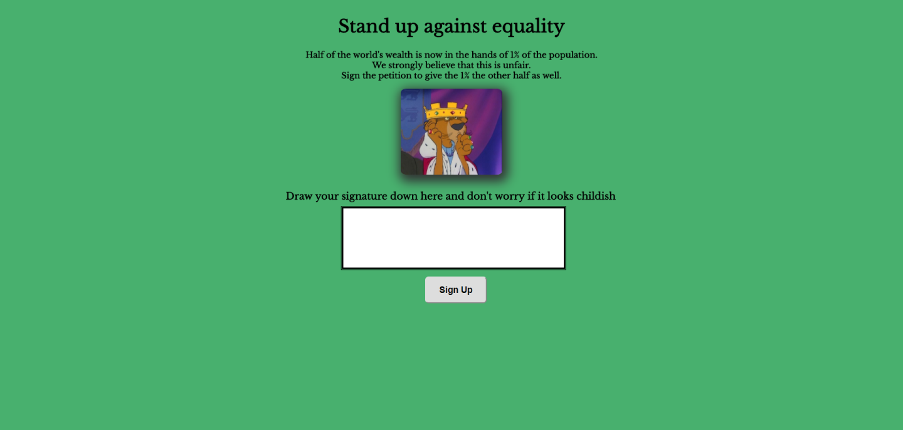
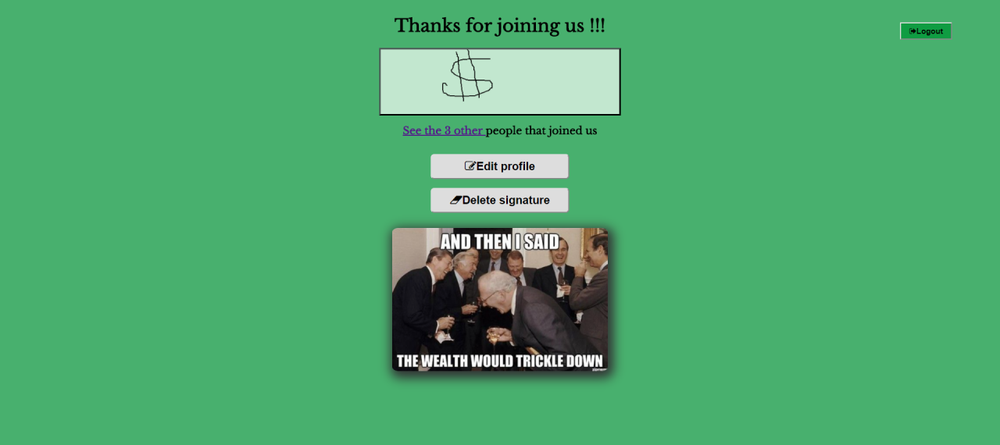

# Petition "Help the richest"

## Summary
The idea behind this project is to create an online petition that visitors can sign to make their voice heard on an issue of your choosing.
"Help the richest" is a sarcastic petition about today's wealth inequality

## Tech Stack
* Handlebars
* PostgreSQL DATABASE_URL
* Express.js on Node.js

## Features
* The application has a user registration form, a login form (showed as a modal) and a logout option.
* Users can add some personal information such as age, city and a personal web page.
* Thanks to a canvas box the user can draw his or her signature to sign the petition
* Users who signed the petition  can see the list of all the other users that signed
* For each city a list of signers can be shown
* Users can edit his/her personal information(city,age,homepage) thanks to an "edit" button
* Users can delete their signatures

****

****

